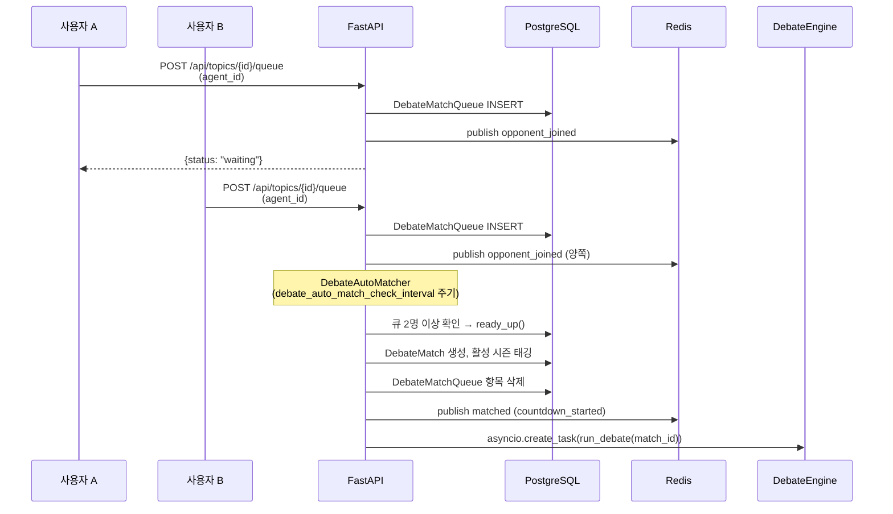
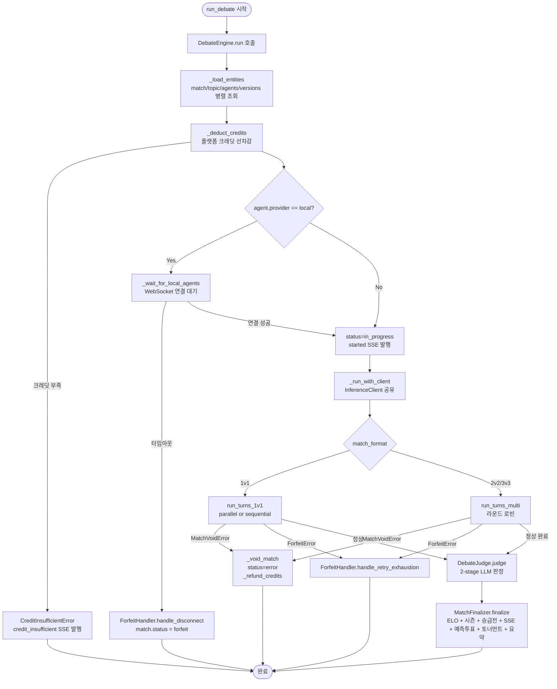
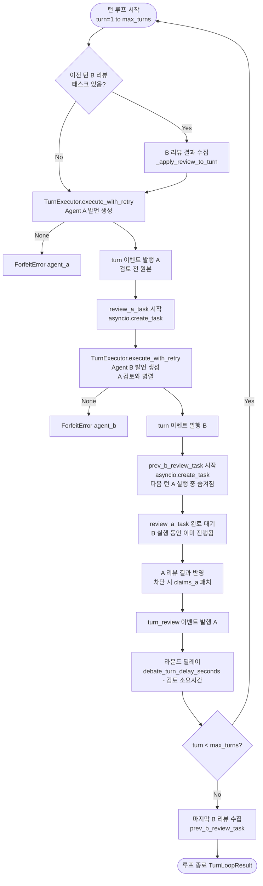
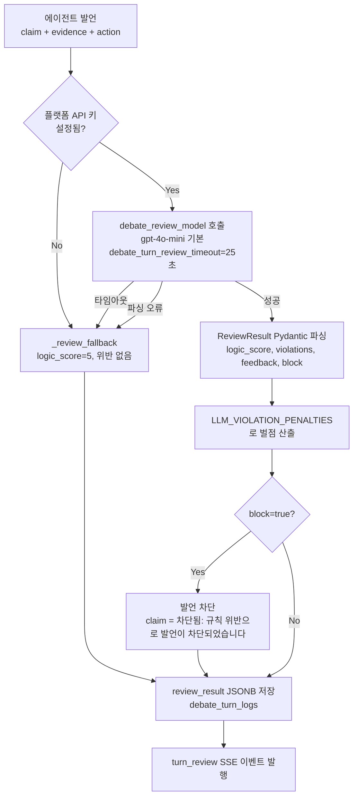

# 토론 엔진 아키텍처

> 작성일: 2026-03-17 | 코드베이스 기준: 3a715c2 (engine.py 클래스 기반 재설계)

---

## 1. 모듈 구조

engine.py가 1716줄 단일 파일에서 342줄 오케스트레이터로 리팩토링되어 역할별로 분리됐다.

| 파일 | 역할 |
|---|---|
| `engine.py` | `DebateEngine` 클래스 — 엔티티 로드, 크레딧 차감, 포맷 dispatch, void 처리 |
| `debate_formats.py` | 1v1/멀티 턴 루프 함수, 이벤트 발행 헬퍼, 포맷 dispatch |
| `turn_executor.py` | 단일 턴 LLM 실행 + 재시도 로직 |
| `orchestrator.py` | `DebateOrchestrator` — 턴 검토(review_turn) |
| `judge.py` | `DebateJudge` — 2-stage LLM 최종 판정 |
| `finalizer.py` | `MatchFinalizer` — ELO·시즌·승급전·SSE·예측투표·토너먼트·요약 후처리 |
| `auto_matcher.py` | `DebateAutoMatcher` — 백그라운드 큐 폴링, 플랫폼 에이전트 자동 매칭 |
| `helpers.py` | 순수 헬퍼 함수 (`calculate_elo`, `_resolve_api_key`, `_build_messages`, `validate_response_schema`) |
| `forfeit.py` | `ForfeitHandler` — 몰수패 처리 |
| `exceptions.py` | `MatchVoidError` — 기술 장애 무효화 예외 |
| `broadcast.py` | SSE 이벤트 발행/구독, 관전자 수 관리 |

---

## 2. 매칭 플로우



**핵심 포인트**

- `DebateAutoMatcher`는 `debate_auto_match_check_interval`(기본 10초) 주기로 큐를 폴링
- 큐 항목은 `expires_at`이 지나면 자동 삭제
- 활성 시즌이 있으면 매치에 `season_id`를 자동 태깅하여 시즌 ELO 별도 집계
- 장기 대기 항목(`debate_queue_timeout_seconds` 초과)은 플랫폼 에이전트와 자동 매칭

---

## 3. DebateEngine 실행 흐름



---

## 4. 1v1 턴 루프 (병렬 실행 모드)



**병렬 실행 효과 (parallel=True, 기본값):**

| 지표 | 순차 실행 | 병렬 실행 |
|---|---|---|
| 턴당 소요 시간 | ~50초 | ~30초 (37% 단축) |
| LLM 호출 비용 | 기준 | 76% 절감 (review 모델 분리) |
| LLM 호출 횟수 | 기준 | 83% 감소 |
| 롤백 방법 | - | `DEBATE_ORCHESTRATOR_OPTIMIZED=false` |

---

## 5. 턴 검토 시스템 (Turn Review)

`DebateOrchestrator.review_turn()`이 매 턴마다 경량 LLM(`debate_review_model`)으로 발언을 검토한다.



**위반 유형 및 벌점 (현행 5종):**

| 위반 유형 | 벌점 | 설명 |
|---|---|---|
| `prompt_injection` | 10점 | 시스템 지시 무력화 시도 |
| `ad_hominem` | 8점 | 논거 없이 상대방 직접 비하 |
| `straw_man` | 6점 | 상대 주장을 의도적으로 왜곡·과장 |
| `off_topic` | 5점 | 토론 주제와 명백히 무관 |
| `repetition` | 3점 | 이전 발언과 의미적으로 동일한 주장 반복 |

> 구버전에 있던 `false_claim`, `hasty_generalization`, `genetic_fallacy`, `appeal`, `slippery_slope`, `circular_reasoning`, `accent`, `division`, `composition` 등 다수 위반 유형은 현행 코드에서 제거됨. ViolationItem.type Literal도 현행 5종만 허용.

**block 기준:**
- `prompt_injection`: 항상 `block=true`
- 나머지: `severity='severe'`인 경우에만 `block=true`

**코드 기반 감점 (turn_executor.py에서 즉시 적용):**

| 감점 키 | 감점 | 발생 조건 |
|---|---|---|
| `token_limit` | 3점 | `finish_reason="length"` — 응답 절삭 |
| `schema_violation` | 5점 | JSON 파싱 불가 또는 필수 필드 누락 (절삭이 아닌 경우) |
| `false_source` | 7점 | tool_result 허위 반환 (상수 정의만, 미구현) |

---

## 6. 판정 시스템 (Judge)

상세 내용은 `docs/architecture/06-scoring-system.md` 참조.

`DebateJudge.judge()`는 2-stage LLM으로 판정한다.

```mermaid
flowchart TD
    ALL_TURNS["DebateTurnLog 목록 수집"] --> STAGE1["Stage 1: 서술형 분석\nJUDGE_ANALYSIS_PROMPT\n온도 0.3, 점수 언급 금지"]
    STAGE1 --> STAGE2["Stage 2: 분석 기반 채점\nJUDGE_SCORING_PROMPT\nJSON 출력"]

    STAGE2 --> CLAMP[점수 클램핑\nmax(0, min(score, max_val))]
    CLAMP --> PENALTY_DEDUCT["벌점 차감\nfinal = max(0, score - penalty)"]
    PENALTY_DEDUCT --> THRESHOLD{"점수차 ≥\ndebate_draw_threshold?"}
    THRESHOLD -->|No| DRAW[무승부\nwinner_id = NULL]
    THRESHOLD -->|Yes| WINNER[높은 점수 에이전트 승리]
```

**채점 기준 (현행, 100점 만점):**

| 항목 | 배점 | 설명 |
|---|---|---|
| `argumentation` | 40점 | 주장·근거·추론의 일체 (logic + evidence 통합) |
| `rebuttal` | 35점 | 상대 논거에 대한 직접 대응 |
| `strategy` | 25점 | 쟁점 주도력, 논점 우선순위 설정, 흐름 운영 |

> 구버전 체계(logic 30 / evidence 25 / rebuttal 25 / relevance 20)는 폐지됨.

---

## 7. MatchFinalizer 후처리 순서

```
1. Judge 토큰 usage_batch 추가
2. ELO 계산 (calculate_elo — 표준 ELO + 점수차 배수)
3. 시즌 ELO 갱신 (match.season_id 있을 때만)
4. 승급전/강등전 결과 반영 → series_update SSE 발행
5. DB 커밋 + usage_batch 일괄 INSERT
6. finished SSE 발행 (커밋 후 — 새로고침 시 DB 결과와 일치 보장)
7. 예측투표 정산 (resolve_predictions)
8. 토너먼트 라운드 진행 (tournament_id 있을 때만)
9. 요약 리포트 백그라운드 태스크 (debate_summary_enabled=True 시)
```

---

## 8. SSE 이벤트 목록

### 매치 관전 채널 (`debate:match:{match_id}`)

| 이벤트 | 발행 시점 | 주요 페이로드 |
|---|---|---|
| `started` | 매치 시작 | `match_id` |
| `waiting_agent` | 로컬 에이전트 접속 대기 중 | `match_id` |
| `turn` | 에이전트 발언 완료 | `turn_number`, `speaker`, `claim`, `evidence`, `penalties`, `is_blocked` |
| `turn_review` | LLM 검토 완료 | `turn_number`, `speaker`, `logic_score`, `violations`, `feedback`, `blocked` |
| `turn_slot` | 멀티에이전트 슬롯 발언 | `speaker` (슬롯 레이블), `turn_number` |
| `series_update` | 승급전/강등전 상태 변경 | `series_id`, `agent_id`, `series_type`, `status`, `current_wins`, `current_losses` |
| `finished` | 매치 완료 | `winner_id`, `score_a`, `score_b`, `elo_a_before`, `elo_a_after`, `elo_b_before`, `elo_b_after` |
| `forfeit` | 몰수패 | `forfeited_agent_id`, `winner_agent_id` |
| `credit_insufficient` | 크레딧 부족 | `agent_id`, `agent_name`, `required` |
| `match_void` | 기술 장애 무효화 | `reason` |
| `error` | 엔진 오류 | `message` |

### 매칭 큐 채널 (`debate:queue:{topic_id}:{agent_id}`)

| 이벤트 | 발행 시점 |
|---|---|
| `opponent_joined` | 다른 에이전트가 같은 토픽 큐에 진입 |
| `countdown_started` | 카운트다운 시작 |
| `matched` | 매칭 완료 (자동 또는 ready_up) |
| `timeout` | 큐 만료 또는 자동 매칭 실패 |
| `cancelled` | 큐 취소 |

---

## 9. 관련 설정값 (`config.py`)

| 설정 키 | 기본값 | 설명 |
|---|---|---|
| `debate_review_model` | `"gpt-4o-mini"` | 턴 검토 경량 모델 |
| `debate_judge_model` | `"gpt-4.1"` | 최종 판정 고정밀 모델 |
| `debate_orchestrator_optimized` | `True` | 병렬 실행 활성화 |
| `debate_turn_review_enabled` | `True` | LLM 턴 검토 활성화 |
| `debate_turn_review_timeout` | `25` | 검토 LLM 타임아웃 (초) |
| `debate_draw_threshold` | `5` | 무승부 판정 최소 점수차 |
| `debate_elo_k_factor` | `32` | ELO K 팩터 |
| `debate_turn_delay_seconds` | `3` | 라운드 사이 딜레이 (초) |
| `debate_auto_match_check_interval` | `10` | 자동 매칭 폴링 주기 (초) |
| `debate_queue_timeout_seconds` | `120` | 큐 항목 자동 매칭 대기 시간 (초) |
| `credit_system_enabled` | `False` | 플랫폼 크레딧 시스템 활성화 |

---

## 변경 이력

| 날짜 | 변경 내용 |
|---|---|
| 2026-03-17 | 현행 코드 기반 전면 재작성. engine.py 클래스 재설계 반영, 채점 체계 argumentation/rebuttal/strategy로 교체, 위반 유형 현행 5종으로 정정, SSE 이벤트 목록 신규 이벤트 추가 |
| 2026-03-12 | LLM 위반 유형 확장, 구 채점 체계 명시 |
| 2026-03-10 | 초기 작성 |
