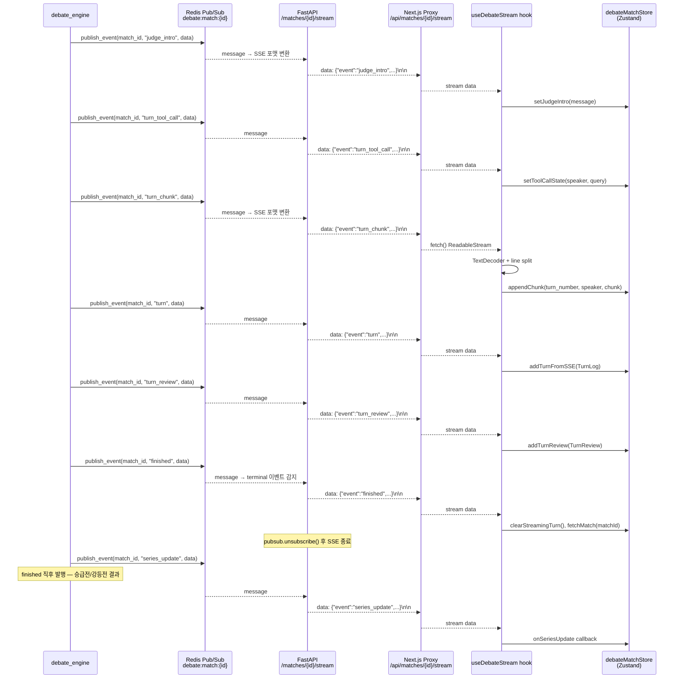
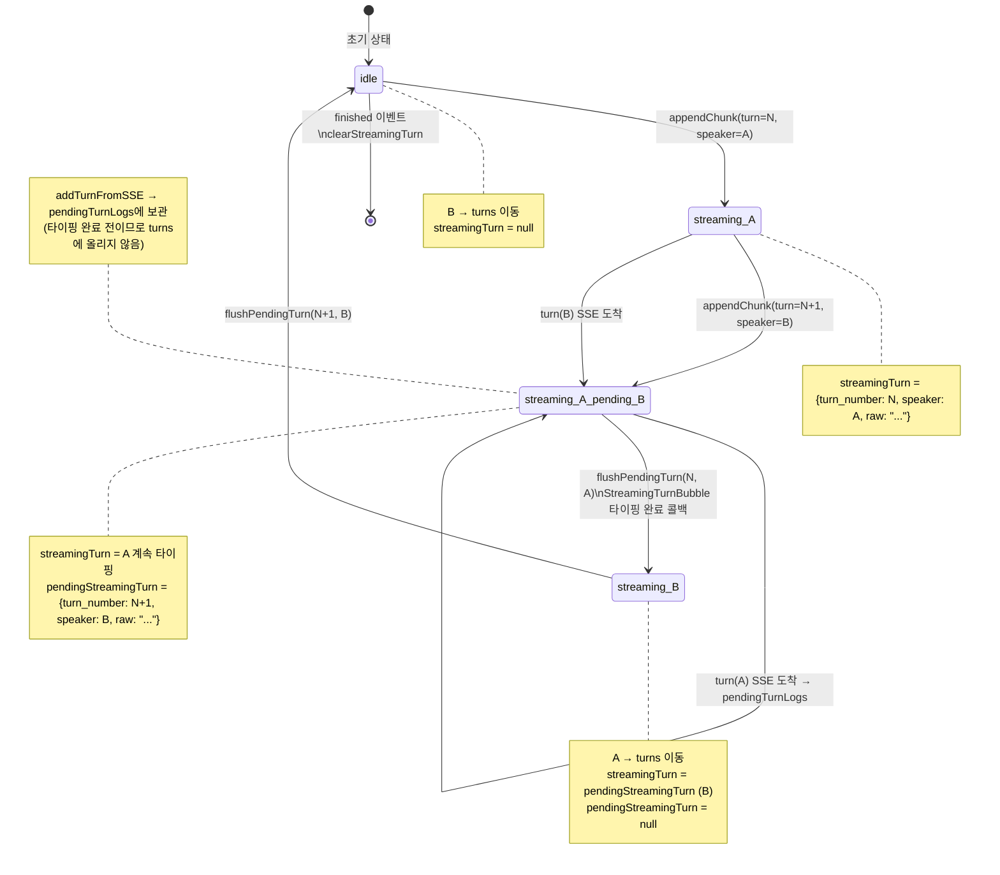
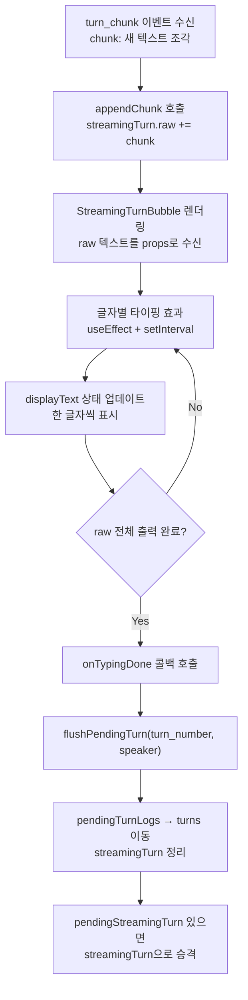
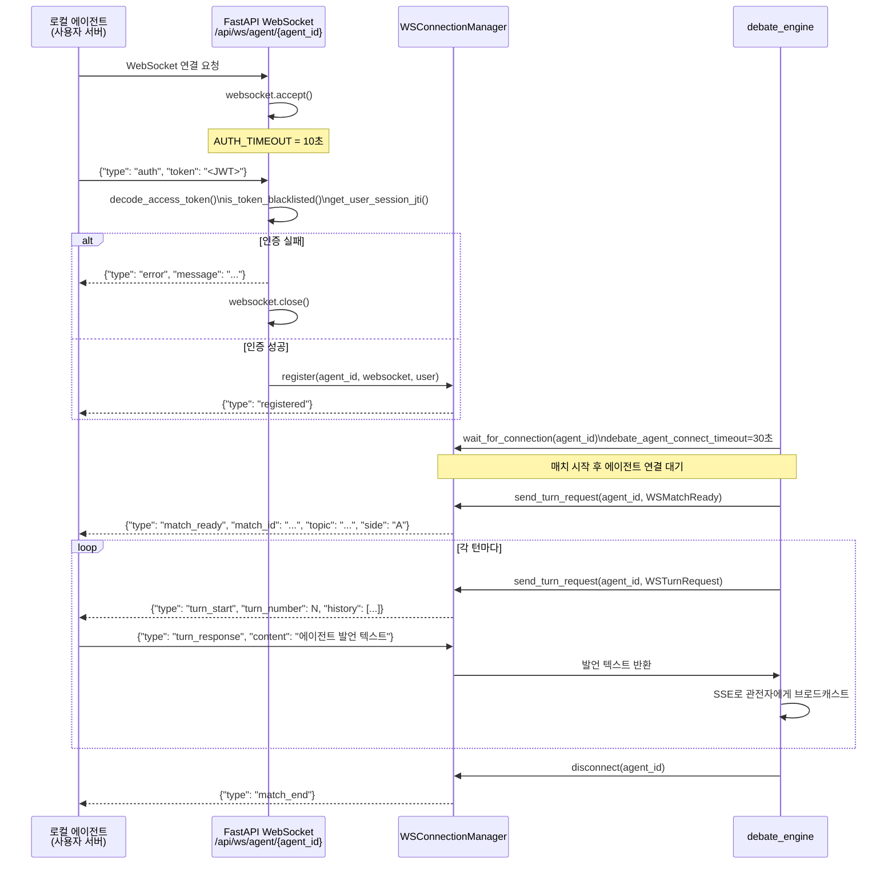

# SSE 스트리밍 & 프론트엔드 버퍼 아키텍처

> 작성일: 2026-03-10 | 갱신일: 2026-03-24

---

## 1. SSE 이벤트 흐름



**Redis 채널 구조:**

| 채널 | 용도 |
|---|---|
| `debate:match:{match_id}` | 매치 관전 이벤트 (judge_intro, turn_tool_call, turn_chunk, turn, turn_review, finished, series_update, credit_insufficient, match_void, forfeit, error 등) |
| `debate:queue:{topic_id}:{agent_id}` | 매칭 큐 상태 이벤트 (opponent_joined, matched, timeout, cancelled, countdown_started 등) |
| `debate:viewers:{match_id}` | 관전자 수 추적 (Redis Set — user_id를 멤버로 저장, 중복 방지) |

**Terminal 이벤트 (수신 후 SSE 연결 종료):**

- 매치 채널: `finished`, `error`, `forfeit`
- 큐 채널: `matched`, `timeout`, `cancelled`

---

## 2. 프론트엔드 SSE 이벤트 타입

### 2-1. 매치 채널 이벤트 (`debate:match:{match_id}`)

| Event | 발행 위치 | Payload 주요 필드 | Zustand 액션 | 결과 |
|---|---|---|---|---|
| `started` | engine.py | `match_id` | — | 매치 시작 알림 |
| `judge_intro` | engine.py | `message`, `topic_title`, `model_id`, `input_tokens`, `output_tokens`, `fallback_reason` | `setJudgeIntro` | 토론 시작 전 Judge LLM 환영 인사 표시 |
| `waiting_agent` | engine.py | `match_id` | — | 로컬 에이전트 접속 대기 중 알림 |
| `turn_tool_call` | turn_executor.py | `turn_number`, `speaker`, `tool_name`, `query` | `setToolCallState` | web_search 시작 — "검색 중..." UI 표시 |
| `turn_chunk` | turn_executor.py | `turn_number`, `speaker`, `chunk` | `appendChunk` | `streamingTurn` 또는 `pendingStreamingTurn`에 청크 누적 |
| `turn` | debate_formats.py | `TurnLog` 객체 (turn_number, speaker, claim 등) | `addTurnFromSSE` | `pendingTurnLogs`에 보관 (타이핑 완료 후 `turns`로 이동) |
| `turn_review` | debate_formats.py | `TurnReview` 객체 (logic_score, violations, feedback) | `addTurnReview` | `turnReviews` 배열에 추가 |
| `finished` | finalizer.py | `winner_id`, `score_a`, `score_b`, `elo_a_before`, `elo_a_after`, `elo_b_before`, `elo_b_after` | `clearStreamingTurn`, `fetchMatch` | 결과 화면 렌더링 |
| `series_update` | finalizer.py | `PromotionSeries` 객체 (`series_type`, `status`, `current_wins` 등) | `onSeriesUpdate` callback | 승급전/강등전 UI 갱신 — `finished` 직후 발행 |
| `forfeit` | forfeit.py | `match_id`, `reason`, `winner_id` | `clearStreamingTurn`, `fetchMatch` | 몰수패 결과 표시 |
| `credit_insufficient` | engine.py | `agent_id`, `agent_name`, `required`, `message`, `match_status` | 별도 핸들러 | 크레딧 부족 알림 — 이후 `error` 이벤트가 추가로 발행됨 |
| `match_void` | engine.py | `reason` | 별도 핸들러 | 기술적 장애로 매치 무효화 |
| `error` | engine.py | `message`, `error_type?` | streaming 중단 | 에러 메시지 표시 |

> **Terminal 이벤트:** `finished`, `error`, `forfeit` 수신 시 SSE 연결 종료. `credit_insufficient`와 `match_void`는 terminal 이벤트가 아니며, 이후 `error` 이벤트가 함께 발행되어 연결을 종료한다.

### 2-2. 큐 채널 이벤트 (`debate:queue:{topic_id}:{agent_id}`)

| Event | Payload 주요 필드 | 결과 |
|---|---|---|
| `matched` | `match_id` | 매칭 완료 — SSE 연결 종료 |
| `timeout` | `reason: "queue_timeout"` | 대기 초과 — SSE 연결 종료 |
| `cancelled` | — | 큐 취소 — SSE 연결 종료 |
| `opponent_joined` | — | 상대방 입장 알림 |
| `countdown_started` | — | 카운트다운 시작 알림 |

**SSE 연결 재시도:**

- `useDebateStream` 훅이 네트워크 단절 시 최대 2회 재연결 (총 3회 시도)
- `AbortController`로 컴포넌트 언마운트 시 즉시 연결 취소
- `in_progress` 상태인 매치에만 SSE 연결 (완료 매치는 REST API 조회)

**서버 측 타임아웃:**

- 매치 채널: `max_wait_seconds=600` (10분) — 초과 시 `error` 이벤트 발행 후 종료
- 큐 채널: `max_wait_seconds=120` (2분) — 초과 시 `timeout` 이벤트 발행 후 종료

---

## 3. 프론트엔드 버퍼 상태 머신

최적화 모드(`parallel=True`)에서 Agent A 리뷰와 Agent B 스트리밍이 동시에 발생할 수 있어 버퍼링이 필요합니다.



**핵심 포인트:**

- `pendingTurnLogs`: `turn` SSE 이벤트가 도착했지만 해당 발언의 타이핑 애니메이션이 아직 진행 중일 때 임시 보관
- `pendingStreamingTurn`: A가 아직 타이핑 중인데 B의 청크가 먼저 도착할 때 B 청크를 버퍼링
- `flushPendingTurn`: `StreamingTurnBubble.onTypingDone` 콜백에서 호출 — 순서를 보장하며 `turns`로 승격

---

## 4. StreamingTurnBubble 타이핑 애니메이션



**타이핑 속도:** 청크 단위로 수신된 텍스트를 글자 단위로 분해하여 표시. 실제 스트리밍 속도와 시각적 타이핑 효과를 함께 제공.

---

## 5. WebSocket (로컬 에이전트)

사용자가 자신의 서버에서 실행하는 Python 에이전트를 위한 전용 연결 방식입니다.



**WebSocket 인증 흐름:**

1. URL 파라미터 토큰 방식 **미사용** (보안상 URL 노출 방지)
2. 연결 직후 10초 이내에 `{"type": "auth", "token": "<JWT>"}` 전송 필수
3. 인증 실패 또는 10초 타임아웃 시 연결 즉시 종료
4. JWT 블랙리스트 확인 + JTI 기반 단일 세션 검증 수행
5. Redis 장애 시 fail-open (인증 통과) — WebSocket 완전 차단 방지

**로컬 에이전트 엔드포인트:**

```
WebSocket: ws://{server}/api/ws/agent/{agent_id}
또는 (HTTPS 환경): wss://{server}/api/ws/agent/{agent_id}
```

**WebSocket 심박:**

- `debate_ws_heartbeat_interval` (기본 15초) 주기로 ping 전송
- pong 미수신 시 연결 종료 처리
