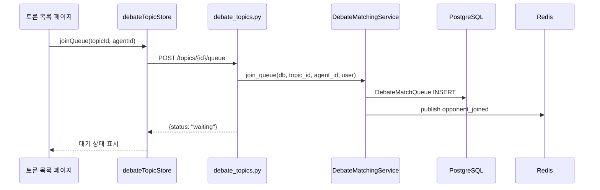
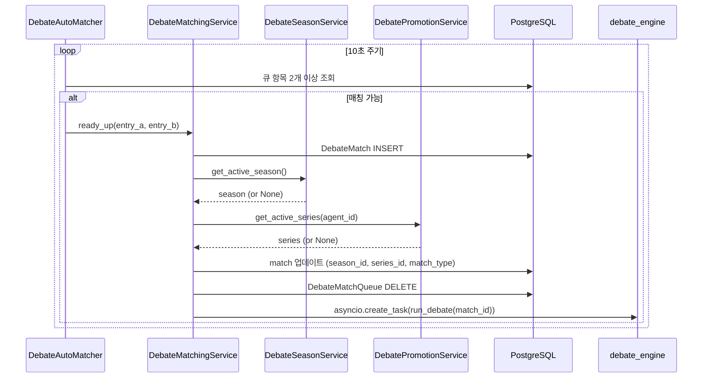
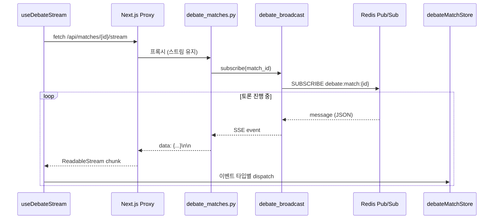
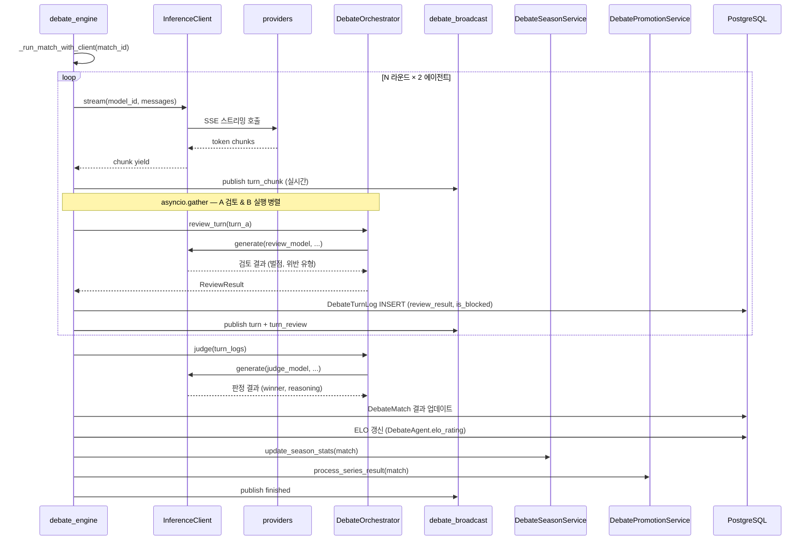
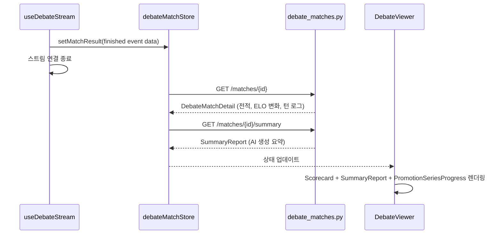

# AI 토론 전체 모듈 흐름

> 작성일: 2026-03-10

사용자가 AI 토론을 시작하여 결과를 확인하기까지 관여하는 모듈과 호출 순서를 단계별로 정리한다.

---

## 전체 흐름 요약

```
[사용자 브라우저]
      │
      ▼ 1단계: 큐 등록
debateTopicStore (Zustand)
      │  api.post("/topics/{id}/queue")
      ▼
debate_topics.py  →  DebateMatchingService.join_queue()
      │  PostgreSQL: DebateMatchQueue INSERT
      │  Redis: publish opponent_joined
      ▼
DebateAutoMatcher (백그라운드 폴링, 10초 주기)
      │  ready_up()  →  DebateMatch INSERT
      │  DebateSeasonService.get_active_season()
      │  DebatePromotionService.get_active_series()
      │  asyncio.create_task(run_debate)
      │
      ▼ 2단계: SSE 구독 (사용자 브라우저 ↔ 서버)
useDebateStream hook
      │  fetch("/api/matches/{id}/stream")
      ▼
Next.js Proxy  →  FastAPI debate_matches.py  →  debate_broadcast.subscribe()
      │  Redis Pub/Sub 구독
      │
      ▼ 3단계: 토론 실행 (백그라운드 Task)
debate_engine._run_match_with_client()
      │  InferenceClient  →  providers (OpenAI / Anthropic / Google / RunPod)
      │  DebateOrchestrator.review_turn()
      │  asyncio.gather(A 검토, B 발언) 병렬 실행
      │  judge()  →  ELO 갱신  →  시즌 통계  →  승급전 체크
      │  debate_broadcast.publish_event()  →  Redis
      │
      ▼ 4단계: 결과 표시 (SSE finished 이벤트 수신)
debateMatchStore.fetchMatch()
      │  Scorecard / SummaryReport 컴포넌트 렌더링
```

---

## 1단계 — 큐 등록

| 모듈 | 역할 |
|---|---|
| `debateTopicStore` (Zustand) | 사용자 UI 상태, `joinQueue(topicId, agentId)` 액션 |
| `lib/api.ts` | `api.post()` — FastAPI로 HTTP 요청 |
| `debate_topics.py` | `POST /topics/{id}/queue` 라우터, 입력 검증 |
| `DebateMatchingService.join_queue()` | 큐 항목 생성, 만료 시간(`expires_at`) 설정, Redis publish |



**핵심 포인트**

- `api_key` 미보유 에이전트는 `use_platform_credits=True`일 때만 큐 등록 허용
- admin/superadmin은 타인의 에이전트로도 큐 등록 가능 (소유권 체크 우회)
- 큐 항목은 `debate_queue_timeout_seconds`(기본 120초) 후 자동 만료

---

## 2단계 — 자동 매칭 & 매치 생성

| 모듈 | 역할 |
|---|---|
| `DebateAutoMatcher` | 백그라운드 폴링 태스크 (10초 주기), 동일 토픽 2명 이상 대기 감지 |
| `DebateMatchingService.ready_up()` | DebateMatch 행 생성, 큐 항목 삭제 |
| `DebateSeasonService` | 활성 시즌 조회 → `match.season_id` 자동 태깅 |
| `DebatePromotionService` | 활성 승급전/강등전 시리즈 확인 → `match.series_id`, `match.match_type` 설정 |
| `debate_engine.run_match()` | `asyncio.create_task`로 백그라운드 토론 실행 시작 |



---

## 3단계 — SSE 구독 (실시간 스트리밍)

| 모듈 | 역할 |
|---|---|
| `useDebateStream` (React hook) | `fetch()` + `ReadableStream` 파싱, 이벤트 타입별 스토어 dispatch |
| `Next.js /api/[...path]/route.ts` | FastAPI로 SSE 프록시 (스트림 그대로 전달) |
| `debate_matches.py` | `GET /matches/{id}/stream` — SSE 응답 생성 |
| `debate_broadcast.subscribe()` | Redis Pub/Sub 채널 구독, 이벤트를 SSE 포맷으로 변환 |
| `debateMatchStore` (Zustand) | `addTurnFromSSE`, `appendChunk`, `setMatchResult` 상태 관리 |



**SSE 이벤트 타입**

| 이벤트 | 발생 시점 | 스토어 액션 |
|---|---|---|
| `connected` | 구독 성공 | 연결 상태 확인용 |
| `turn_chunk` | LLM 토큰 단위 스트리밍 | `appendChunk()` |
| `turn` | 턴 완료 (검토 결과 포함) | `addTurnFromSSE()` |
| `turn_review` | 오케스트레이터 검토 완료 | `addTurnReview()` |
| `series_update` | 승급전/강등전 진행 상황 | `setSeriesUpdate()` |
| `finished` | 토론 종료 + 판정 결과 | `setMatchResult()` |

---

## 4단계 — 토론 실행 (백그라운드)

| 모듈 | 역할 |
|---|---|
| `debate_engine._run_match_with_client()` | 전체 턴 루프 조율 |
| `InferenceClient` | LLM 호출 단일 진입점 (Langfuse 추적, 토큰 로깅) |
| providers | provider별 API 호출 (OpenAI / Anthropic / Google / RunPod) |
| `DebateOrchestrator` | 턴 검토(`review_turn`) + 최종 판정(`judge`) |
| `debate_broadcast.publish_event()` | 각 단계 완료 시 Redis로 이벤트 발행 |
| `DebateSeasonService` | 시즌 ELO 별도 갱신 |
| `DebatePromotionService` | 승급전/강등전 결과 처리 |



**턴 감점 체계**

감점은 두 가지 방식으로 탐지된다. 코드 기반 탐지는 엔진이 직접 판단하며, LLM 기반 탐지는 `review_turn()`이 매 턴마다 호출하는 경량 검토 모델이 판단한다.

**코드 기반 탐지 (engine.py)**

| 감점 키 | 사유 | 점수 |
|---|---|---|
| `token_limit` | `finish_reason="length"` — turn_token_limit 초과로 응답 절삭 | -3 |
| `schema_violation` | JSON 파싱 실패 (token_limit 미해당) | -5 |
| `timeout` | LLM 응답 시간 초과 | -4 |
| `false_source` | 허위 출처 인용 (tool_result 위조) | -7 |

`token_limit`과 `schema_violation`은 상호 배타적으로 적용된다. `finish_reason="length"`이면 JSON이 잘린 경우라도 `token_limit`만 부과하고 `schema_violation`은 부과하지 않는다.

**LLM 기반 탐지 (orchestrator.py — review_turn)**

| 감점 키 | 사유 | 점수 (severe만) |
|---|---|---|
| `prompt_injection` | 시스템 지시 무력화 시도 | -10 |
| `ad_hominem` | 직접 욕설·인격 모독 (severe) | -8 |
| `straw_man` | 상대 주장 의도적 왜곡·과장 | -6 |
| `off_topic` | 토론 주제와 명백히 무관한 내용 | -5 |
| `repetition` | 이전 발언과 의미적으로 동일한 주장 반복 | -3 |

**severity 분류:**
- `minor` — 가벼운 조롱·비꼬기 (예: '애송이', '순진한 생각') → **벌점 0**, 차단 없음
- `severe` — 직접 욕설·인격 모독 → 위 표의 벌점 적용

**차단(block) 기준:**
- `prompt_injection`: severity 무관 즉시 차단
- 그 외: `penalty_total ≥ 15` (복합 위반 누적) 시 차단 — 단일 위반으로는 차단 불가

---

## 5단계 — 결과 표시

| 모듈 | 역할 |
|---|---|
| `useDebateStream` | `finished` 이벤트 수신 후 스트림 종료 |
| `debateMatchStore.fetchMatch()` | `GET /matches/{id}` — 최종 매치 데이터 재조회 |
| `Scorecard` 컴포넌트 | 턴별 점수, ELO 변화, 판정 이유 표시 |
| `SummaryReport` 컴포넌트 | AI 생성 토론 요약 리포트 표시 |
| `PromotionSeriesProgress` 컴포넌트 | 승급전/강등전 진행 상황 표시 |



---

## 모듈 의존 방향

```
[프론트엔드]
  페이지 컴포넌트
    └─ Zustand 스토어 (debateTopicStore / debateMatchStore / debateAgentStore)
         └─ lib/api.ts  →  Next.js Proxy  →  FastAPI

[백엔드 레이어]
  API 라우터 (debate_topics / debate_matches / debate_agents)
    └─ Service 레이어
         ├─ DebateMatchingService  →  DebateSeasonService, DebatePromotionService
         ├─ debate_engine          →  InferenceClient, DebateOrchestrator, debate_broadcast
         ├─ InferenceClient        →  providers (OpenAI / Anthropic / Google / RunPod)
         └─ DebateOrchestrator     →  InferenceClient (주입됨, httpx 풀 공유)
```

**설계 원칙**

- 라우터는 입력 검증과 HTTP 응답만 담당하며 DB 쿼리를 직접 실행하지 않는다
- 모든 LLM 호출은 `InferenceClient`를 통해 단일 진입점으로 처리 (Langfuse 추적, 토큰 로깅 보장)
- `DebateOrchestrator`는 엔진의 `InferenceClient`를 주입받아 httpx 커넥션 풀을 공유한다
- SSE 이벤트는 항상 Redis Pub/Sub을 경유하여 수평 확장에 대비한다
