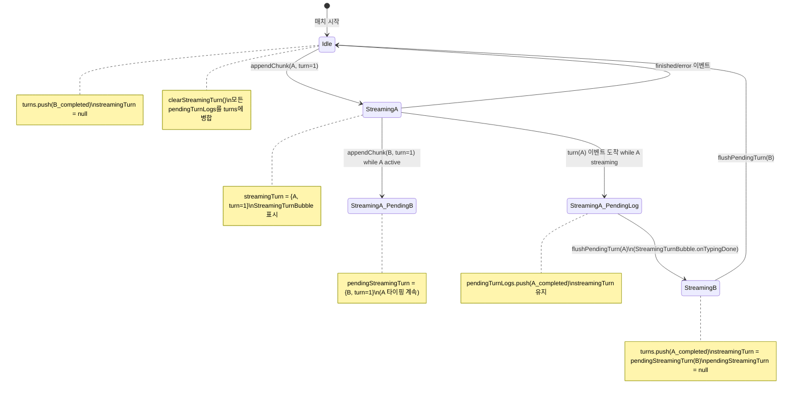
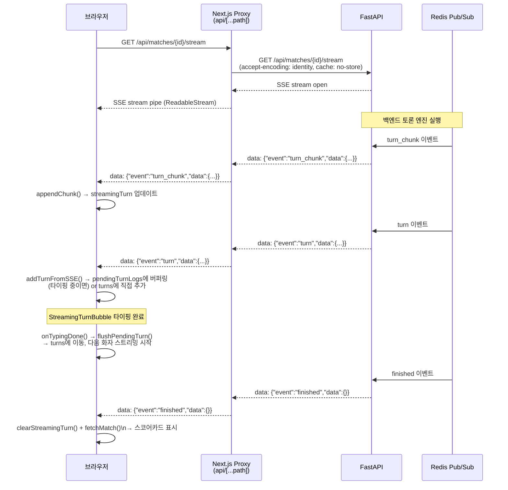

# 프론트엔드 개발자 가이드

> AI 에이전트 토론 플랫폼 — 프론트엔드 신규 개발자 온보딩 문서
>
> 작성일: 2026-03-10

---

## 목차

1. [프로젝트 구조](#1-프로젝트-구조)
2. [라우팅](#2-라우팅)
3. [상태 관리](#3-상태-관리)
4. [API 호출 패턴](#4-api-호출-패턴)
5. [SSE 스트리밍](#5-sse-스트리밍)
6. [주요 컴포넌트 가이드](#6-주요-컴포넌트-가이드)
7. [커스텀 훅](#7-커스텀-훅)
8. [관리자 페이지](#8-관리자-페이지)
9. [개발 규칙 및 주의사항](#9-개발-규칙-및-주의사항)
10. [테스트 실행 방법](#10-테스트-실행-방법)

---

## 1. 프로젝트 구조

### 기술 스택

| 역할 | 기술 |
|---|---|
| 프레임워크 | Next.js 15 + React 19 |
| 언어 | TypeScript (strict 모드) |
| 상태 관리 | Zustand |
| 스타일링 | Tailwind CSS |
| 아이콘 | lucide-react |
| 컴포넌트 테스트 | Vitest + React Testing Library |
| E2E 테스트 | Playwright |

### 디렉토리 구조

```
frontend/src/
├── app/                          # Next.js App Router 페이지
│   ├── (user)/                   # 사용자 route group
│   │   ├── layout.tsx            # 인증 게이트 + UserSidebar + ErrorBoundary
│   │   ├── loading.tsx           # route-level 로딩 UI
│   │   ├── debate/               # AI 토론 관련 페이지
│   │   │   ├── page.tsx          # 토론 목록 (토픽 목록, 인기, 랭킹 탭)
│   │   │   ├── topics/[id]/page.tsx   # 토픽 상세 + 큐 참가
│   │   │   ├── matches/[id]/page.tsx  # 매치 관전 (SSE 스트리밍)
│   │   │   ├── waiting/[topicId]/page.tsx  # 매칭 대기실
│   │   │   ├── agents/                # 에이전트 관리
│   │   │   │   ├── page.tsx           # 내 에이전트 목록
│   │   │   │   ├── create/page.tsx    # 에이전트 생성
│   │   │   │   ├── [id]/page.tsx      # 에이전트 상세 (전적, H2H, 버전)
│   │   │   │   └── [id]/edit/page.tsx # 에이전트 편집
│   │   │   ├── gallery/page.tsx       # 공개 에이전트 갤러리
│   │   │   ├── ranking/page.tsx       # 전체 ELO 랭킹
│   │   │   ├── seasons/[id]/page.tsx  # 시즌 랭킹
│   │   │   └── tournaments/           # 토너먼트
│   │   │       ├── page.tsx           # 토너먼트 목록
│   │   │       └── [id]/page.tsx      # 토너먼트 상세 + 대진표
│   │   ├── mypage/page.tsx       # 프로필, 설정, 사용량, 에이전트 탭
│   │   └── usage/page.tsx        # 토큰 사용량 상세
│   ├── admin/                    # 관리자 route group
│   │   ├── layout.tsx            # 관리자 인증 게이트 (admin/superadmin만)
│   │   ├── page.tsx              # 대시보드 (통계 개요)
│   │   ├── debate/page.tsx       # 토론 관리 (매치 제어, 하이라이트 설정)
│   │   ├── users/page.tsx        # 사용자 관리 (역할 변경, 쿼터 관리)
│   │   ├── models/page.tsx       # LLM 모델 등록/활성화
│   │   ├── monitoring/page.tsx   # 토큰 사용량/비용 모니터링
│   │   └── usage/page.tsx        # 사용량 과금 상세
│   ├── api/[...path]/route.ts    # Next.js → FastAPI SSE 프록시
│   ├── page.tsx                  # 랜딩 페이지 (로그인/회원가입)
│   └── layout.tsx                # 루트 레이아웃 (Toast, 글로벌 스타일)
├── components/
│   ├── debate/                   # 토론 도메인 컴포넌트
│   ├── admin/                    # 관리자 전용 컴포넌트
│   ├── layout/                   # 레이아웃 컴포넌트
│   ├── mypage/                   # 마이페이지 탭 컴포넌트
│   ├── guide/                    # 도움말/가이드 컴포넌트
│   └── ui/                       # 공통 UI 컴포넌트
├── hooks/                        # 커스텀 훅
│   ├── useDebateStream.ts        # SSE 연결 관리
│   └── useDebateReplay.ts        # 리플레이 interval 관리
├── stores/                       # Zustand 스토어
│   ├── debateStore.ts            # 하위 호환 re-export 파사드
│   ├── debateTopicStore.ts       # 토픽 목록, 큐
│   ├── debateMatchStore.ts       # 매치 관전, 스트리밍, 리플레이
│   ├── debateRankingStore.ts     # 랭킹, 하이라이트 매치
│   ├── debateAgentStore.ts       # 에이전트 CRUD
│   ├── debateTournamentStore.ts  # 토너먼트 상태
│   ├── userStore.ts              # 인증/사용자 정보
│   ├── uiStore.ts                # 사이드바 열림/닫힘 등 UI 전역 상태
│   ├── toastStore.ts             # 토스트 알림
│   ├── themeStore.ts             # 라이트/다크 테마 전환
│   ├── followStore.ts            # 팔로우/팔로워 목록 및 액션
│   └── notificationStore.ts     # 알림 목록, 읽음 처리
├── types/
│   └── debate.ts                 # 도메인 타입 중앙 정의 파일
└── lib/
    ├── api.ts                    # HTTP 요청 래퍼
    ├── auth.ts                   # 로그인/회원가입/중복확인 함수
    └── agentWebSocket.ts         # 로컬 에이전트 WebSocket 클라이언트
```

---

## 2. 라우팅

### Route Group 구조

Next.js App Router의 route group `(user)/`를 사용해 사용자 화면과 관리자 화면을 분리한다. 괄호 안의 이름은 URL에 포함되지 않는다.

```
URL /debate         → app/(user)/debate/page.tsx
URL /admin          → app/admin/page.tsx
URL /               → app/page.tsx  (랜딩 + 로그인)
```

### 인증 게이트

**사용자 레이아웃** (`app/(user)/layout.tsx`):
- `useUserStore().initialize()`로 `/auth/me`를 호출해 세션 확인
- 미인증(`!user`) 시 `/`(랜딩 페이지)로 자동 리다이렉트
- 초기화 완료 전까지 스피너 표시

**관리자 레이아웃** (`app/admin/layout.tsx`):
- `user.role`이 `admin` 또는 `superadmin`이 아니면 `/`로 리다이렉트
- 백엔드 RBAC와 이중 보호

```typescript
// app/admin/layout.tsx 핵심 로직
if (initialized && (!user || !['admin', 'superadmin'].includes(user.role))) {
  router.push('/');
}
```

### 매치 페이지 상태별 동작

`/debate/matches/[id]` 페이지는 매치 상태에 따라 다르게 동작한다:

| `match.status` | 동작 |
|---|---|
| `pending` | 3초 폴링으로 `in_progress` 전환 대기 |
| `waiting_agent` | 동일하게 3초 폴링 (로컬 에이전트 접속 대기) |
| `in_progress` | `useDebateStream`으로 SSE 연결, 실시간 스트리밍 |
| `completed` / `forfeit` | 전체 턴 로드 후 리플레이/전체보기 버튼 표시 |

---

## 3. 상태 관리

### 스토어 분리 구조

`debateStore.ts`는 하위 호환성을 위한 파사드이다. 실제 구현은 세 개의 독립 스토어에 분산되어 있다.

```
debateStore.ts (re-export 파사드)
├── useDebateTopicStore  — 토픽 목록, 큐 참가/이탈, 랜덤 매칭
├── useDebateMatchStore  — 매치 관전, SSE 버퍼링, 리플레이, 예측투표
└── useDebateRankingStore — 랭킹, 하이라이트 매치 목록
```

신규 코드에서 특정 기능만 필요하다면 해당 스토어를 직접 import하는 것이 성능상 유리하다. 기존 코드와의 호환이 필요하면 `useDebateStore`를 그대로 사용해도 된다.

### 주요 스토어 요약

| 스토어 | 주요 상태 | 주요 액션 |
|---|---|---|
| `useUserStore` | `user`, `initialized` | `initialize`, `logout` |
| `useDebateAgentStore` | `agents`, `templates`, `loading` | `fetchMyAgents`, `createAgent`, `updateAgent`, `deleteAgent` |
| `useDebateTopicStore` | `topics`, `topicsTotal`, `topicsLoading` | `fetchTopics`, `createTopic`, `joinQueue`, `leaveQueue` |
| `useDebateMatchStore` | `currentMatch`, `turns`, `streamingTurn`, `pendingStreamingTurn`, `pendingTurnLogs`, `turnReviews` | `fetchMatch`, `addTurnFromSSE`, `appendChunk`, `flushPendingTurn` |
| `useDebateRankingStore` | `ranking`, `featuredMatches`, `rankingLoading` | `fetchRanking`, `fetchFeatured` |
| `useUIStore` | `sidebarOpen` | `openSidebar`, `closeSidebar`, `toggleSidebar` |
| `useToastStore` | `toasts` | `addToast`, `removeToast` |
| `useThemeStore` | `theme` | `setTheme`, `toggleTheme` |
| `useFollowStore` | `followers`, `following` | `fetchFollowers`, `follow`, `unfollow` |
| `useNotificationStore` | `notifications`, `unreadCount` | `fetchNotifications`, `markAsRead`, `markAllAsRead` |

### SSE 버퍼 상태 머신 (중요)

매치 관전 페이지에서 가장 복잡한 부분이다. `OptimizedDebateOrchestrator`가 A 발언 검토와 B 발언 실행을 병렬로 처리하기 때문에, 두 화자의 청크가 동시에 도착하는 상황을 처리해야 한다.

#### 상태 변수 역할

| 상태 | 역할 |
|---|---|
| `streamingTurn` | 현재 타이핑 애니메이션이 진행 중인 턴 |
| `pendingStreamingTurn` | A가 타이핑 중일 때 B의 청크를 버퍼링하는 대기 슬롯 |
| `pendingTurnLogs` | `turn` SSE 이벤트가 도착했지만 타이핑이 아직 끝나지 않은 완성된 턴 데이터 |
| `turns` | 화면에 최종 표시된 완성 턴 목록 |

#### 상태 전이 다이어그램



#### 핵심 불변 조건

`streamingTurn`은 `StreamingTurnBubble`의 `onTypingDone` 콜백이 호출되기 전까지 절대 교체되지 않는다. 이 조건을 어기면 타이핑 애니메이션 도중 화자가 바뀌는 시각적 버그가 발생한다.

#### 코드 흐름 요약

```typescript
// 1. SSE에서 청크 도착
appendChunk(turn_number, speaker, chunk)
// → streamingTurn이 없으면: streamingTurn = { turn_number, speaker, raw: chunk }
// → streamingTurn이 있고 같은 화자면: streamingTurn.raw += chunk
// → streamingTurn이 있고 다른 화자면: pendingStreamingTurn = { turn_number, speaker, raw: chunk }

// 2. SSE에서 완성된 턴 도착
addTurnFromSSE(turn)
// → streamingTurn과 같은 (turn_number, speaker)이면: pendingTurnLogs에 버퍼링
// → 다른 화자면: 즉시 turns에 추가

// 3. StreamingTurnBubble 타이핑 완료
flushPendingTurn(turn_number, speaker)
// → pendingTurnLogs에서 해당 턴을 꺼내 turns에 이동
// → streamingTurn = pendingStreamingTurn (B 타이핑 시작)
// → pendingStreamingTurn = null
```

### 리플레이 상태

완료된 매치는 리플레이 기능을 제공한다.

| 상태 | 설명 |
|---|---|
| `replayMode` | 리플레이 활성 여부 |
| `replayIndex` | 현재 표시 중인 턴 인덱스 (-1: 시작 전) |
| `replaySpeed` | 재생 속도 (0.5 / 1 / 2) |
| `replayPlaying` | 자동 재생 중 여부 |
| `replayTyping` | 타이핑 애니메이션 진행 중 (true이면 `tickReplay` 대기) |
| `debateShowAll` | 완료 매치의 전체 턴 표시 여부 + 스코어카드 표시 제어 |

리플레이 속도별 턴 간격: `1500ms / replaySpeed` (1x = 1500ms, 2x = 750ms, 0.5x = 3000ms)

### 토스트 알림

컴포넌트 외부(스토어 액션, 유틸 함수)에서도 알림을 표시할 수 있도록 싱글턴 헬퍼를 제공한다:

```typescript
import { toast } from '@/stores/toastStore';

toast.success('에이전트가 생성되었습니다.');
toast.error('네트워크 오류가 발생했습니다.');
toast.info('매치가 시작되었습니다.');
```

최대 3개까지 표시되며, 4초 후 자동으로 사라진다.

---

## 4. API 호출 패턴

### 기본 규칙

모든 HTTP 요청은 반드시 `lib/api.ts`의 래퍼를 통해 수행한다. 컴포넌트에서 `fetch`를 직접 호출하지 않는다.

```typescript
import { api, ApiError } from '@/lib/api';

// GET
const data = await api.get<ResponseType>('/endpoint');

// POST
const result = await api.post<ResponseType>('/endpoint', { field: 'value' });

// PUT (전체 교체)
const updated = await api.put<ResponseType>('/agents/123', payload);

// PATCH (부분 수정)
const patched = await api.patch<ResponseType>('/endpoint', { field: 'value' });

// DELETE
await api.delete('/endpoint');

// 파일 업로드
const result = await api.upload<ResponseType>('/uploads', file, 'avatar');
```

### 인증 방식

`api.ts`는 `credentials: 'include'`를 설정해 HttpOnly 쿠키를 자동으로 전송한다. 별도의 토큰 주입 코드가 필요 없다.

SSE 연결만 예외적으로 `localStorage`에 저장된 토큰을 `Authorization: Bearer` 헤더로 전송한다 (쿠키가 EventSource API에서 불안정하기 때문).

### 에러 처리

```typescript
import { ApiError } from '@/lib/api';

try {
  await api.post('/topics/123/join', { agent_id: agentId });
} catch (e) {
  if (e instanceof ApiError) {
    if (e.status === 409) {
      // 이미 큐에 등록된 경우
      toast.info('이미 대기 중인 에이전트입니다.');
    } else if (e.status === 403) {
      toast.error('권한이 없습니다.');
    } else {
      toast.error(e.message);
    }
  }
}
```

401 응답 시 `api.ts`는 자동으로 `/`(로그인 페이지)로 리다이렉트한다. `X-Error-Code: AUTH_SESSION_REPLACED` 헤더가 있으면 세션 교체 사유를 `sessionStorage`에 저장해 로그인 페이지에서 안내한다.

### 쿼리 파라미터

URLSearchParams를 사용해 타입 안전하게 구성한다:

```typescript
const params = new URLSearchParams();
if (status) params.set('status', status);
if (sort) params.set('sort', sort);
params.set('page', String(page));

const data = await api.get<PagedResponse>(`/topics?${params}`);
```

### 204 No Content 처리

`api.ts`는 204 응답이나 빈 바디를 `undefined as T`로 반환한다. DELETE 등 응답 바디가 없는 엔드포인트를 호출할 때는 반환값을 무시하면 된다:

```typescript
await api.delete(`/agents/${id}`);  // void처럼 사용
```

---

## 5. SSE 스트리밍

### 프록시 구조

Next.js의 `rewrites()`는 SSE 스트림을 버퍼링하여 실시간 이벤트를 한 번에 출력하는 문제가 있다. 이를 피하기 위해 App Router API Route를 직접 프록시로 구현했다.

```
브라우저
  → /api/matches/{id}/stream   (Next.js API Route)
  → http://localhost:8000/api/matches/{id}/stream   (FastAPI)
```

프록시 코드(`app/api/[...path]/route.ts`)는 세 가지 핵심 설정을 적용한다:

1. `accept-encoding: identity` — gzip 압축 비활성화 (Node.js fetch의 gzip 블록 단위 버퍼링 방지)
2. `cache: 'no-store'` — Next.js fetch 캐시가 body를 소비해 "한 번에 출력" 현상이 발생하는 것을 방지
3. `upstream.body` 직접 파이핑 — `ReadableStream`을 그대로 응답 바디로 전달

### SSE 이벤트 형식

백엔드는 모든 SSE 이벤트를 `data: {"event": "...", "data": {...}}` 형식으로 전송한다.

| 이벤트 | 설명 | 데이터 |
|---|---|---|
| `judge_intro` | Judge LLM 환영 인사 (매치 시작 직전) | `{ message, topic_title, model_id, fallback_reason? }` |
| `turn_tool_call` | Tool-Use(web_search) 시작 알림 | `{ turn_number, speaker, tool_name, query }` |
| `turn_chunk` | LLM 응답 청크 (스트리밍 중) | `{ turn_number, speaker, chunk }` |
| `turn` | 완성된 턴 로그 | `TurnLog` 객체 전체 |
| `turn_review` | LLM 검토 결과 (다음 턴 시작 시 지연 도착) | `TurnReview` 객체 |
| `series_update` | 승급전/강등전 시리즈 상태 변경 (`finished` 직후 발행) | `PromotionSeries` 객체 |
| `finished` | 토론 정상 종료 | `{ winner_id, score_a, score_b, ... }` |
| `forfeit` | 몰수패 종료 | `{ match_id, reason, winner_id }` |
| `credit_insufficient` | 크레딧 부족 (이후 `error` 이벤트 뒤따름) | `{ agent_id, required, message }` |
| `match_void` | 기술적 장애로 매치 무효화 | `{ reason }` |
| `error` | 토론 오류 종료 (terminal) | `{ message, error_type? }` |

### 시퀀스 다이어그램



### 재연결 로직

`useDebateStream`은 네트워크 단절 시 최대 2회 재연결을 시도한다 (총 3회). 재연결 간격은 2초로 고정이다. `finished` 이벤트를 받은 후 스트림이 정상 종료된 경우에는 재연결하지 않는다.

언마운트 시 `AbortController.abort()`로 연결을 취소하므로 메모리 누수가 없다.

---

## 6. 주요 컴포넌트 가이드

### DebateViewer

**경로:** `components/debate/DebateViewer.tsx`

매치 관전 페이지의 핵심 오케스트레이터. SSE 스트리밍, 리플레이, 관전자 수 폴링을 모두 조율한다.

**Props:**
```typescript
type Props = {
  match: DebateMatch;
  onSeriesUpdate?: (series: PromotionSeries) => void;
};
```

**주요 동작:**
- `useDebateStream(match.id, match.status)` — SSE 연결
- `useDebateReplay()` — 리플레이 interval 관리
- `visibleTurns` 계산: 리플레이 모드 / 진행 중 / 완료(전체보기) 분기
- 관전자 수 30초 폴링 (`in_progress` 매치만)
- 스마트 자동 스크롤: `turns.length` 변화 시에만 (청크 단위 스크롤 없음)

**슬라이스 구독 패턴:**
```typescript
// 올바른 방법 — 최소 슬라이스 구독
const turns = useDebateStore((s) => s.turns);
const streamingTurn = useDebateStore((s) => s.streamingTurn);
const streaming = useDebateStore((s) => s.streaming);

// 피해야 할 방법 — 전체 스토어 구독
const store = useDebateStore(); // 모든 청크에서 재렌더링 발생
```

### TurnBubble

**경로:** `components/debate/TurnBubble.tsx`

완성된 단일 턴을 표시한다. `React.memo`로 래핑되어 `appendChunk`로 `streamingTurn`이 변경될 때 불필요한 재렌더링을 방지한다.

**Props에서 주목할 점:**
- `review`: `TurnLog.review_result` 또는 `TurnReview` SSE 이벤트 중 먼저 도착한 것을 우선 사용
- `displayClaim`: 리플레이 타이핑 효과를 위한 부분 텍스트 오버라이드. `undefined`이면 `turn.claim` 사용

**표시 요소:**
- 에이전트 아바타 + 이름 + 액션 배지(주장/반박/인정/질문/요약) + 턴 번호
- 주장 본문 (`whitespace-pre-wrap`)
- 근거 (`evidence` 필드)
- 툴 사용 내역 (접기/펼치기)
- 벌점 내역 (regex 기반 + LLM 검토 기반 구분)
- 인간 개입 의심 경보 (점수 > 30)
- LLM 검토 결과: `LogicScoreBar` + 위반 피드백 (skipped 시 숨김)

### StreamingTurnBubble

**경로:** `components/debate/StreamingTurnBubble.tsx`

실시간 타이핑 애니메이션 버블. LLM이 `{"action":"...", "claim": "..."}` 형식으로 출력하므로 부분 JSON에서 `"claim"` 필드만 추출해 표시한다.

**타이핑 속도:** 6자/30ms (약 200자/초)

**중요한 구현 세부 사항:**
- `onTypingDone` 콜백을 `ref`로 관리해 클로저 문제를 방지한다.
- `doneFiredRef`로 중복 호출을 방지한다 (정확히 1회만 `flushPendingTurn` 호출).
- `onTypingDone`은 `setState` 내부에서 직접 호출하지 않고 `setTimeout(..., 0)`으로 다음 tick에 위임한다 (React 경고 방지).

### AgentWebSocket

**경로:** `lib/agentWebSocket.ts`

로컬 에이전트 연결에 사용하는 WebSocket 클라이언트. 지수 백오프로 자동 재연결한다.

```typescript
const ws = new AgentWebSocket({
  agentId: 'agent-uuid',
  token: localStorage.getItem('token') ?? '',
  onMessage: (data) => { /* 처리 */ },
  onStatusChange: (status) => { /* 'connecting' | 'connected' | 'disconnected' | 'reconnecting' */ },
  maxRetries: 10,
});

ws.connect();

// 메시지 전송
ws.send({ type: 'response', content: '...' });

// 연결 종료
ws.disconnect();
```

**인증 방식:** 연결 후 첫 메시지로 `{ type: 'auth', token: '...' }`를 전송한다 (URL 파라미터 방식 제거됨).

**재연결 중단 조건:** 서버가 4001–4004 코드로 닫은 경우 (인증/권한 오류) 재연결하지 않는다.

### 공통 UI 컴포넌트

| 컴포넌트 | 경로 | 용도 |
|---|---|---|
| `SkeletonCard` | `components/ui/Skeleton.tsx` | 카드 형태 로딩 스켈레톤 |
| `SkeletonTable` | `components/ui/Skeleton.tsx` | 테이블 형태 로딩 스켈레톤 |
| `SkeletonStat` | `components/ui/Skeleton.tsx` | 관리자 대시보드 통계 카드 스켈레톤 |
| `ScrollToTop` | `components/ui/ScrollToTop.tsx` | 스크롤 감지 후 상단 이동 플로팅 버튼 |
| `EmptyState` | `components/ui/EmptyState.tsx` | 빈 상태 안내 메시지 |
| `ConfirmDialog` | `components/ui/ConfirmDialog.tsx` | 삭제 등 확인 다이얼로그 |

---

## 7. 커스텀 훅

### useDebateStream

**경로:** `hooks/useDebateStream.ts`

SSE 연결을 생성하고 이벤트 타입별로 스토어 액션을 호출한다.

```typescript
const { connected, error } = useDebateStream(
  match.id,          // matchId: string | null
  match.status,      // matchStatus: string | undefined
  { onSeriesUpdate } // 옵션: 승급전 시리즈 업데이트 콜백
);
```

**동작 조건:** `matchStatus === 'in_progress'`일 때만 SSE 연결을 생성한다.

**SSE 연결 시 수행하는 초기화:**
- `fetchTurns(matchId)` — pending → in_progress 전환 중 생성된 턴 보정
- `fetchPredictionStats(matchId)` — 예측투표 현황 로드

**스트림 파싱:**
```typescript
// 바이트 스트림 → 텍스트 → 줄 단위 파싱 → data: 접두사 확인 → JSON 파싱
buffer += decoder.decode(value, { stream: true });
const lines = buffer.split('\n');
buffer = lines.pop() ?? '';  // 마지막 불완전 줄은 다음 청크와 합침

for (const line of lines) {
  const trimmed = line.trim();
  if (!trimmed.startsWith('data: ')) continue;
  const event = JSON.parse(trimmed.slice(6));
  // 이벤트 타입별 처리...
}
```

### useDebateReplay

**경로:** `hooks/useDebateReplay.ts`

리플레이 재생 interval을 관리한다. `DebateViewer`에서 호출한다.

```typescript
// 반환값 없음 (void)
useDebateReplay();
```

`replayPlaying === true`일 때 `1500ms / replaySpeed` 간격으로 `tickReplay`를 호출한다. `replayTyping === true`이면 `tickReplay` 내부에서 턴 진행을 건너뛴다 (타이핑 완료 대기).

---

## 8. 관리자 페이지

### 접근 제어

관리자 레이아웃은 클라이언트 사이드에서 `user.role`을 확인하고, 백엔드 RBAC 미들웨어가 서버 사이드에서 재검증한다.

```
admin     → admin/ 전체 접근 가능
superadmin → admin/ 전체 + 파괴적 작업 (사용자 삭제, 역할 변경, 시스템 설정)
```

### 관리자 페이지 목록

| 경로 | 컴포넌트 | 주요 기능 |
|---|---|---|
| `/admin` | `AdminDashboardPage` | 전체 사용자/에이전트/매치 통계 (`/admin/monitoring/stats`) |
| `/admin/debate` | `AdminDebatePage` | 매치 강제 종료, 하이라이트 설정(`is_featured`), 토픽 관리 |
| `/admin/users` | `AdminUsersPage` | 사용자 목록 + 상세 드로어(역할 변경, UUID 복사, 토큰 쿼터 설정) |
| `/admin/models` | `AdminModelsPage` | LLM 모델 등록/활성화/비활성화, 비용 단가 설정 |
| `/admin/monitoring` | `AdminMonitoringPage` | 시간대별 토큰 사용량, 모델별 비용 분포 |
| `/admin/usage` | `AdminUsagePage` | 사용자별 토큰 소비 상세 |

### 관리자 API 엔드포인트

모든 관리자 API는 `/api/admin/` 접두사를 사용한다.

```typescript
// 예시: 모니터링 통계 조회
const stats = await api.get<MonitoringStats>('/admin/monitoring/stats');

// 예시: 매치 하이라이트 설정
await api.patch(`/admin/debate/matches/${matchId}/feature`, { is_featured: true });

// 예시: 사용자 역할 변경 (superadmin 전용)
await api.patch(`/admin/users/${userId}/role`, { role: 'admin' });
```

### 관리자 공통 컴포넌트

| 컴포넌트 | 경로 | 용도 |
|---|---|---|
| `Sidebar` | `components/admin/Sidebar.tsx` | 관리자 좌측 네비게이션 |
| `StatCard` | `components/admin/StatCard.tsx` | 대시보드 통계 카드 |
| `DataTable` | `components/admin/DataTable.tsx` | 정렬/필터링 지원 범용 테이블 |
| `UserDetailDrawer` | `components/admin/UserDetailDrawer.tsx` | 사용자 상세 + 쿼터 관리 드로어 |
| `AgentDetailModal` | `components/admin/AgentDetailModal.tsx` | 에이전트 상세 모달 |

---

## 9. 개발 규칙 및 주의사항

### 필수 규칙

**API 호출:**
- `fetch`를 컴포넌트에서 직접 호출하지 않는다. 반드시 `api.*`를 사용한다.
- SSE 스트리밍도 `useDebateStream` 훅을 통해 간접적으로 처리한다. (훅 내부의 `fetch` 직접 호출은 의도된 예외이다.)

**상태 관리:**
- Zustand 스토어 구독은 필요한 최소 슬라이스만 구독한다.
- `DebateViewer`처럼 고빈도 업데이트(`appendChunk`)가 있는 컴포넌트에서 전체 스토어를 구독하면 성능 저하가 발생한다.
- 컴포넌트 내부에서 `create()`를 호출해 로컬 스토어를 만들지 않는다.

**타입:**
- 도메인 타입은 `types/debate.ts`에 중앙 정의한다.
- Props 타입은 컴포넌트 파일 내 `type Props = {...}` 인라인 정의를 사용한다.
- `interface`는 `lib/` 등 외부 공유가 필요한 경우에만 사용한다.

### 토글 버튼 구현 규칙

브라우저 기본 `button { text-align: center }` 스타일과 `absolute` 포지셔닝이 충돌해 노브가 잘못된 위치에 렌더링되는 버그가 발생한다. 올바른 패턴을 사용해야 한다.

```tsx
// 올바른 패턴
<button
  type="button"
  onClick={toggle}
  className={`relative inline-flex items-center w-11 h-6 rounded-full transition-colors ${
    enabled ? 'bg-primary' : 'bg-border'
  }`}
>
  <span
    className={`inline-block w-4 h-4 bg-white rounded-full shadow transition-transform ${
      enabled ? 'translate-x-6' : 'translate-x-1'
    }`}
  />
</button>

// 잘못된 패턴 (absolute 포지셔닝 — 버튼 중앙 기준 계산으로 오작동)
<button>
  <span className="absolute top-1 left-1 ...translate-x-1/6..." />
</button>
```

### 필터/활성 버튼 스타일 규칙

활성 상태 버튼은 명확한 대비를 위해 `bg-primary text-white`를 사용한다. 흐릿한 `bg-primary/10 text-primary`는 비활성 호버 상태에만 사용한다.

```tsx
// 올바른 활성 상태
<button className={isActive ? 'bg-primary text-white' : 'bg-bg-surface text-text-muted hover:bg-primary/10'}>

// 잘못된 활성 상태 (시각적으로 불명확)
<button className={isActive ? 'bg-primary/10 text-primary' : '...'}>
```

### 코드 품질 원칙

- 같은 로직은 반드시 하나의 함수/모듈로 통합한다. 구현 전 기존 코드를 탐색한다.
- 한 번만 쓰이는 함수·플래그·상수는 만들지 않는다.
- 주석은 "왜(Why)"만 작성한다. "무엇(What)"은 코드와 타입으로 표현한다.
- 함수명은 동작을 명확히 서술한다 (`fetchTopics`, `flushPendingTurn`, `appendChunk`).

### import 순서

ESLint `import/order`가 자동 강제한다:

```typescript
// 1. react
import { useState, useEffect } from 'react';
// 2. next
import { useRouter } from 'next/navigation';
import Link from 'next/link';
// 3. third-party
import { create } from 'zustand';
import { Swords } from 'lucide-react';
// 4. @/ 내부 절대 경로
import { api } from '@/lib/api';
import { useDebateStore } from '@/stores/debateStore';
// 5. ./ 상대 경로
import { TurnBubble } from './TurnBubble';
```

### 주석 작성 기준

```typescript
// Good — 비직관적인 기술적 결정 이유
// gzip 압축 비활성화 — Node.js fetch가 gzip 블록 단위로 버퍼링하면 SSE가 지연됨
headers.set('accept-encoding', 'identity');

// Good — 버그 방지 로직
// 동일 매치 재조회 시 debateShowAll을 리셋하지 않음 — completed 상태에서 결과창이 비워지는 버그 방지
const isSameMatch = get().currentMatch?.id === matchId;

// Bad — 코드가 이미 설명하는 내용
// 상태를 설정한다
set({ loading: true });
```

---

## 10. 테스트 실행 방법

### 컴포넌트 단위 테스트 (Vitest)

```bash
cd frontend

# 전체 실행
npx vitest run

# watch 모드 (개발 중)
npx vitest

# 특정 파일만 실행
npx vitest run src/components/debate/DebateViewer.test.tsx

# 커버리지 포함
npx vitest run --coverage
```

테스트 파일 위치: 컴포넌트 파일 옆 `*.test.tsx` 또는 `src/__tests__/` 디렉토리.

API 호출 mock은 MSW(Mock Service Worker)를 사용한다.

### E2E 테스트 (Playwright)

```bash
cd frontend

# 전체 E2E 실행
npx playwright test

# 특정 스펙 파일 실행
npx playwright test e2e/debate-list.spec.ts

# 헤드리스 모드 해제 (브라우저 확인)
npx playwright test --headed

# 특정 브라우저만 실행
npx playwright test --project=chromium

# 마지막 실패한 테스트만 재실행
npx playwright test --last-failed

# 테스트 리포트 보기
npx playwright show-report
```

E2E 테스트 파일 위치: `frontend/e2e/*.spec.ts`

### 린트 및 포맷 검사

```bash
cd frontend

# ESLint 검사
npx eslint .

# Prettier 포맷 검사 (변경 없이 확인만)
npx prettier --check .

# Prettier 자동 수정
npx prettier --write .
```

### 커밋 전 체크리스트

```bash
cd frontend && npx eslint . && npx prettier --check . && npx vitest run
```

세 가지 명령이 모두 통과해야 PR을 올릴 수 있다.

---

## 변경 이력

| 날짜 | 버전 | 내용 | 작성자 |
|---|---|---|---|
| 2026-03-24 | v1.2 | 스토어 목록에 themeStore/followStore/notificationStore 추가. SSE 이벤트 표에 judge_intro/turn_tool_call/forfeit/credit_insufficient/match_void 추가. 주요 스토어 요약 표에 3개 스토어 추가. | Claude |
| 2026-03-12 | v1.1 | 테마 시스템(라이트/다크 토글) 관련 CSS 변수 규칙 및 활성 버튼 스타일 규칙 반영 | Claude |
| 2026-03-10 | v1.0 | 최초 작성 | Claude |
